##这个文档是做什么的？

用于帮助搭建FastDDS测试用的环境，运行我们的代码。
通过走完该步骤，你能够在你的linux上进行FastDDS-python绑定的代码开发。
注：教程中有些步骤可能是冗余的，如果你的水平够高，可以尝试忽略。

##内容说明

该文档包含以下的一些软件的入门要求，在此基础上尽量做到通俗易懂：
1.VScode 
2.Linux(ubuntu-22.04)和Vmware
3.python与anaconda
4.more...

##1 安装Linux操作系统

我们的代码运行在linux上，为了在windows上进行开发和代码调试，你需要运行linux虚拟机，有两种方式，一种是Vmware(推荐)，另一种是wsl。
为此，你需要一个linux镜像，我使用的是[ubuntu-22.04 LTS](https://releases.ubuntu.com/jammy/)
*（推荐使用：ubuntu-22.04.3-live-server-amd64.iso）*


###1.1 Vmware虚拟机

####1.1.1虚拟机的下载和安装
虚拟机安装包下载链接：https://pan.baidu.com/s/1fmgsY5-qFn-_WzJs31Q8lg  提取码：xiao
虚拟机安装网址：vmware下载_vmware下载免费中文版客户端[虚拟机]-下载之家 (downza.cn)
密钥：JU090-6039P-08409-8J0QH-2YR7F

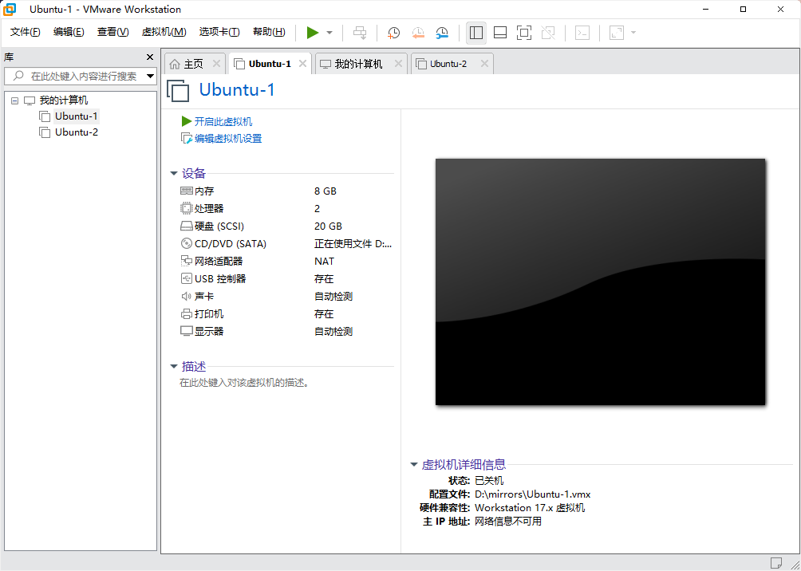


**[注意]这里最好开8个G的内存**
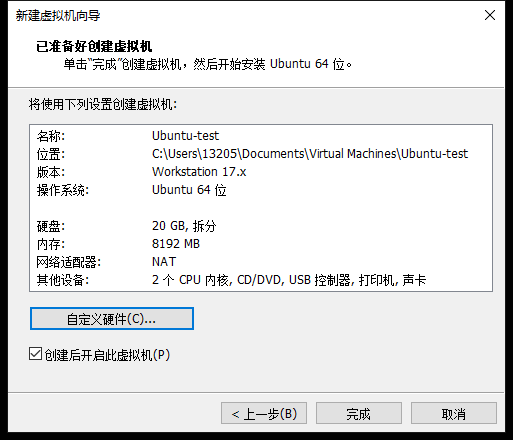


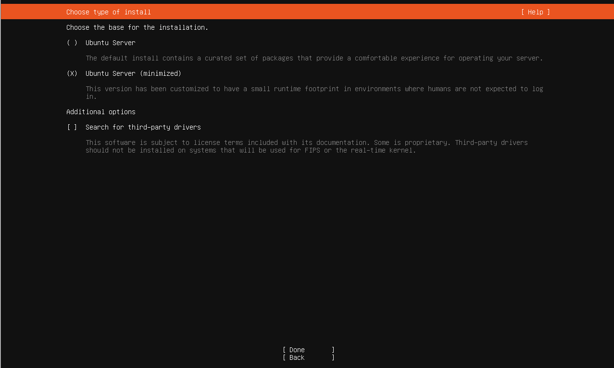

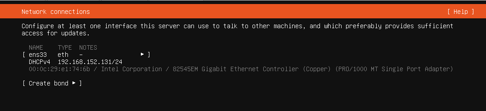

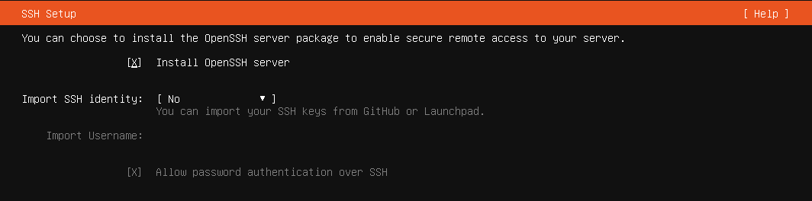

其他未经标注的地方，一律done。

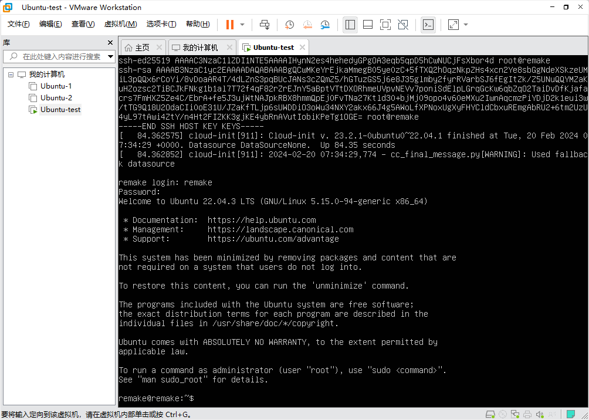

创建并运行一个虚拟机后，你需要安装vmtools，这部分可以参考GPT给的答案：


在 Ubuntu 虚拟机上安装 VMware Tools 可以提高虚拟机的性能和用户体验，例如改善鼠标性能、提供更好的屏幕分辨率支持和共享文件夹功能。以下是在 Ubuntu 上安装 VMware Tools 的步骤：

#### 方法 1: 使用 VMware 提供的安装程序

1. **启动 Ubuntu 虚拟机**。
2. 在 VMware 的菜单栏中，选择 **虚拟机** > **安装 VMware Tools**。这将挂载 VMware Tools 的 ISO 到 Ubuntu 虚拟机中的光驱。
3. 在 Ubuntu 中，打开一个终端窗口。
4. 创建一个挂载点并挂载 VMware Tools 的 ISO 文件（如果系统没有自动挂载的话）：

   ```bash
   mkdir -p /mnt/cdrom
   sudo mount /dev/cdrom /mnt/cdrom
   ```

5. 进入挂载目录，并解压 VMware Tools 的安装包：

   ```bash
   cd /mnt/cdrom
   tar xzvf VMwareTools-*.tar.gz -C /tmp
   ```

6. 运行 VMware Tools 的安装脚本：

   ```bash
   cd /tmp/vmware-tools-distrib
   sudo ./vmware-install.pl
   ```

7. 按照屏幕上的提示操作。大多数情况下，可以接受默认设置。
8. 安装完成后，卸载 ISO 并重启虚拟机：

   ```bash
   sudo umount /mnt/cdrom
   reboot
   ```

#### 方法 2: 使用开源版本 Open-VM-Tools (推荐)

对于大多数 Linux 发行版，包括 Ubuntu，推荐使用开源版本的 VMware Tools，即 `open-vm-tools`，因为它更容易安装且通常包含在发行版的软件仓库中。

1. 打开一个终端窗口。
2. 使用以下命令安装 `open-vm-tools`：

   ```bash
   sudo apt update
   sudo apt install open-vm-tools
   ```

3. 如果您运行的是 Ubuntu 桌面版，并希望在虚拟机和宿主机之间共享剪贴板和文件，则还需要安装 `open-vm-tools-desktop`：

   ```bash
   sudo apt install open-vm-tools-desktop
   ```

4. 安装完成后，重启虚拟机以确保所有模块都正确加载：

   ```bash
   reboot
   ```

使用 `open-vm-tools` 是在 Ubuntu 虚拟机上安装 VMware Tools 的推荐方法，因为它能够提供与 VMware 提供的原版 VMware Tools 相同的主要功能，且安装过程更简单、更快捷。


安装成功后，你可以输入如下指令来进行验证。
```bash 
vmware-toolbox-cmd -v
```
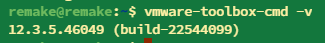


####1.1.2使用terminus来与你的虚拟机交互（可选）
使用terminus来管理你的终端，实现**更舒服**的交互。
要实现这项功能，你需要在安装的时候把OpenSSH装上，然后你可能需要输入 ip addr来拿到SSH的地址。
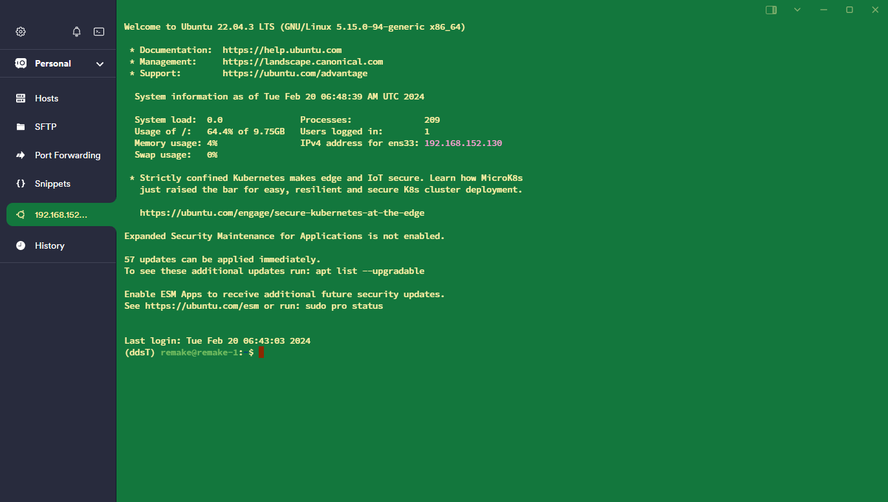
*通过SSH进行cmd交互*

*通过ftp进行文件的传输和文件的管理*
    
    


###1.2 WSL虚拟机（弃用）

相比于Vmware，WSL的优点是方便你可以直接使用主机的vscode或其他的编辑器去修改代码进行测试，可以直接通过windows的文件夹访问到linux文件夹。
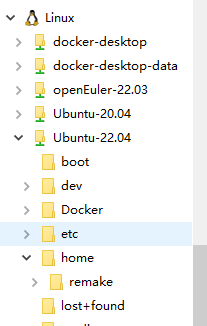
但是它有个缺点，**它的网络模式使得我还没解决两台WSL虚拟机进行网络通信的问题**，这个问题使得我们不能进行多机的DDS代码调试。所以该方法基本上已经被弃用了。


##1.2 miniconda的安装
miniconda是anaconda的精简版本，[在此处可以进行安装。](https://docs.anaconda.com/free/miniconda/miniconda-install/)

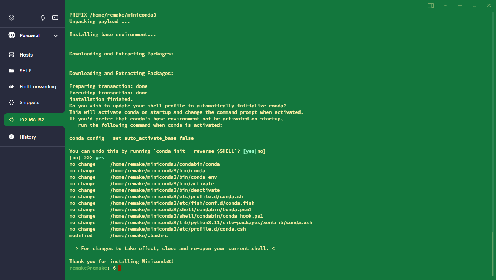

安装后，刷新一下环境变量
```bash
source ~/.bashrc
```
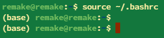

当出现(base)时，说明我们的conda已经装好了。
接着我们创建一个我们代码运行需要的环境，并激活该环境，最好将该环境直接添加到启动脚本里去。
要使用Conda创建一个名为`ddsT`的环境，并指定Python版本为3.11.5，您可以在终端或命令提示符中运行以下命令：

```bash
conda create --name ddsT python=3.11.5
```

这将创建一个新的Conda环境，并安装指定版本的Python。一旦环境创建完成，您可以使用以下命令来激活该环境：

```bash
conda activate ddsT
```

激活环境后，您可以在该环境中安装其他所需的包或进行其他操作。当您完成工作并想退出环境时，可以使用以下命令：

```bash
conda deactivate
```
在bashrc中添加conda activate ddsT，以让你登录就进到该环境当中
```bash
sudo apt install nano
nano ~/.bashrc
```
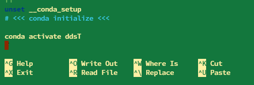

```bash
source ~/.bashrc
```
到目前为止，确保你正确地安装了conda，并创建了一个python==3.11.5的环境，你在linux下激活了该环境，这样我们就可以进行到下一步。


##1.3 FastDDS-python绑定的安装

此为该文档中最重要也是内容最多的一步，由于[原本的教程](https://fast-dds.docs.eprosima.com/en/latest/installation/sources/sources_linux.html)写的很散乱，且会遇到大大小小的坑，故在此对整个流程进行梳理。
###1.3.1 依赖项的安装


```bash
sudo apt install cmake g++ python3-pip wget git
sudo apt install libasio-dev libtinyxml2-dev
sudo apt install libssl-dev
```


###1.3.2 Fast DDS Python bindings 安装
```bash
pip3 install -U colcon-common-extensions vcstool
```
*这一步时间比较长*


```bash
sudo apt install swig
sudo apt install libpython3-dev
```


```bash
mkdir ~/Fast-DDS-python
cd ~/Fast-DDS-python
wget https://raw.githubusercontent.com/eProsima/Fast-DDS-python/main/fastdds_python.repos
mkdir src
vcs import src < fastdds_python.repos
```
这一步有个坑点，wget那一步下载不下来，你可以去这个网站上把这个链接中的文本复制下来，然后在本地创建一个fastrtps.repos，把文件内容写进去：
```bash
touch fastdds_python.repos
nano fastdds_python.repos
```
```
repositories:
    foonathan_memory_vendor:
        type: git
        url: https://github.com/eProsima/foonathan_memory_vendor.git
        version: master
    fastcdr:
        type: git
        url: https://github.com/eProsima/Fast-CDR.git
        version: master
    fastdds:
        type: git
        url: https://github.com/eProsima/Fast-DDS.git
        version: master
    fastdds_python:
        type: git
        url: https://github.com/eProsima/Fast-DDS-python.git
        version: main
    fastddsgen:
        type: git
        url: https://github.com/eProsima/Fast-DDS-Gen.git
        version: master
    fastddsgen/thirdparty/idl-parser:
        type: git
        url: https://github.com/eProsima/IDL-Parser.git
        version: master
```

最后一步从vcs导入也特别容因为网络问题导错，你可以在我上传的文件夹里找到完整的。
如果是如下的过程，就说明是成功的：


然后，接着在这个Fast-DDS-python目录上，运行如下命令编译：
注：这个编译过程比较长，耐心等待。
```bash
colcon build
```
以下是一次编译运行成功的log，这涉及到一些警告，但没有有太大问题：
```
(ddsT) remake@remake:~/Fast-DDS-python$ colcon build
[0.338s] WARNING:colcon.colcon_core.verb:No task extension to 'build' a 'gradle' package
Starting >>> fastcdr 
Starting >>> foonathan_memory_vendor
Finished <<< fastcdr [2.76s]                                                                            
--- stderr: foonathan_memory_vendor                                
Cloning into 'foo_mem-ext'...
HEAD is now at 0f07757 Release 0.7-3
---
Finished <<< foonathan_memory_vendor [26.4s]
Starting >>> fastrtps
[Processing: fastrtps]                             
[Processing: fastrtps]                                      
[Processing: fastrtps]                                       
[Processing: fastrtps]                                       
[Processing: fastrtps]                                       
[Processing: fastrtps]                                       
[Processing: fastrtps]                                       
[Processing: fastrtps]                                       
[Processing: fastrtps]                                       
Finished <<< fastrtps [4min 38s]                             
Starting >>> fastdds_python
--- stderr: fastdds_python                                     
/home/remake/Fast-DDS-python/install/fastrtps/include/fastdds/dds/core/policy/QosPolicies.hpp:1362: Warning 325: Nested class not currently supported (const_iterator ignored)
/home/remake/Fast-DDS-python/install/fastrtps/include/fastdds/rtps/common/LocatorList.hpp:45: Warning 401: Nothing known about base class 'LocatorsIterator'. Ignored.
/home/remake/Fast-DDS-python/install/fastrtps/include/fastdds/dds/core/LoanableSequence.hpp:1: Warning 401: Nothing known about base class 'LoanableTypedCollection< eprosima::fastdds::dds::SampleInfo,std::true_type >'. Ignored.
/home/remake/Fast-DDS-python/install/fastrtps/include/fastdds/dds/core/LoanableSequence.hpp:1: Warning 401: Maybe you forgot to instantiate 'LoanableTypedCollection< eprosima::fastdds::dds::SampleInfo,std::true_type >' using %template.
/home/remake/Fast-DDS-python/install/fastrtps/include/fastdds/rtps/common/Time_t.h:87: Warning 509: Overloaded method eprosima::fastrtps::Time_t::is_infinite(eprosima::fastrtps::Time_t const &) effectively ignored,
/home/remake/Fast-DDS-python/install/fastrtps/include/fastdds/rtps/common/Time_t.h:73: Warning 509: as it is shadowed by eprosima::fastrtps::Time_t::is_infinite() const.
/home/remake/Fast-DDS-python/install/fastrtps/include/fastdds/rtps/common/Time_t.h:145: Warning 509: Overloaded method eprosima::fastrtps::rtps::Time_t::seconds() effectively ignored,
/home/remake/Fast-DDS-python/install/fastrtps/include/fastdds/rtps/common/Time_t.h:140: Warning 509: as it is shadowed by eprosima::fastrtps::rtps::Time_t::seconds() const.
/home/remake/Fast-DDS-python/install/fastrtps/include/fastdds/rtps/common/Time_t.h:172: Warning 509: Overloaded method eprosima::fastrtps::rtps::Time_t::fraction() effectively ignored,
/home/remake/Fast-DDS-python/install/fastrtps/include/fastdds/rtps/common/Time_t.h:167: Warning 509: as it is shadowed by eprosima::fastrtps::rtps::Time_t::fraction() const.
/home/remake/Fast-DDS-python/install/fastrtps/include/fastdds/rtps/common/WriteParams.h:151: Warning 509: Overloaded method eprosima::fastrtps::rtps::WriteParams::source_timestamp() effectively ignored,
/home/remake/Fast-DDS-python/install/fastrtps/include/fastdds/rtps/common/WriteParams.h:141: Warning 509: as it is shadowed by eprosima::fastrtps::rtps::WriteParams::source_timestamp() const.
/home/remake/Fast-DDS-python/install/fastrtps/include/fastdds/rtps/common/WriteParams.h:179: Warning 509: Overloaded method eprosima::fastrtps::rtps::WriteParams::source_timestamp(eprosima::fastrtps::rtps::Time_t &&) effectively ignored,
/home/remake/Fast-DDS-python/install/fastrtps/include/fastdds/rtps/common/WriteParams.h:165: Warning 509: as it is shadowed by eprosima::fastrtps::rtps::WriteParams::source_timestamp(eprosima::fastrtps::rtps::Time_t const &).
/home/remake/Fast-DDS-python/install/fastrtps/include/fastdds/dds/core/policy/QosPolicies.hpp:2027: Warning 451: Setting a const char * variable may leak memory.
/home/remake/Fast-DDS-python/build/fastdds_python/src/swig/CMakeFiles/fastdds_python.dir/fastddsPYTHON_wrap.cxx: In function ‘PyObject* PyInit__fastdds_python()’:
/home/remake/Fast-DDS-python/build/fastdds_python/src/swig/CMakeFiles/fastdds_python.dir/fastddsPYTHON_wrap.cxx:982:64: warning: ‘void PyEval_InitThreads()’ is deprecated [-Wdeprecated-declarations]
  982 | #     define SWIG_PYTHON_INITIALIZE_THREADS  PyEval_InitThreads()
      |                                              ~~~~~~~~~~~~~~~~~~^~
/home/remake/Fast-DDS-python/build/fastdds_python/src/swig/CMakeFiles/fastdds_python.dir/fastddsPYTHON_wrap.cxx:151206:3: note: in expansion of macro ‘SWIG_PYTHON_INITIALIZE_THREADS’
151206 |   SWIG_PYTHON_INITIALIZE_THREADS;
       |   ^~~~~~~~~~~~~~~~~~~~~~~~~~~~~~
In file included from /home/remake/miniconda3/envs/ddsT/include/python3.11/Python.h:95,
                 from /home/remake/Fast-DDS-python/build/fastdds_python/src/swig/CMakeFiles/fastdds_python.dir/fastddsPYTHON_wrap.cxx:180:
/home/remake/miniconda3/envs/ddsT/include/python3.11/ceval.h:132:37: note: declared here
  132 | Py_DEPRECATED(3.9) PyAPI_FUNC(void) PyEval_InitThreads(void);
      |                                     ^~~~~~~~~~~~~~~~~~
/home/remake/Fast-DDS-python/build/fastdds_python/src/swig/CMakeFiles/fastdds_python.dir/fastddsPYTHON_wrap.cxx: In function ‘PyObject* _wrap_delete_InstanceHandleValue_t(PyObject*, PyObject*)’:
/home/remake/Fast-DDS-python/build/fastdds_python/src/swig/CMakeFiles/fastdds_python.dir/fastddsPYTHON_wrap.cxx:31560:16: warning: ‘void operator delete(void*, std::size_t)’ called on unallocated object ‘temp1’ [-Wfree-nonheap-object]
31560 |         delete arg1;
      |                ^~~~
/home/remake/Fast-DDS-python/build/fastdds_python/src/swig/CMakeFiles/fastdds_python.dir/fastddsPYTHON_wrap.cxx:31532:51: note: declared here
31532 |   eprosima::fastrtps::rtps::InstanceHandleValue_t temp1 ;
      |                                                   ^~~~~
---
Finished <<< fastdds_python [22.0s]
Starting >>> fastdds_python_examples
--- stderr: fastdds_python_examples                                    
/home/remake/Fast-DDS-python/install/fastrtps/include/fastdds/dds/core/LoanableTypedCollection.hpp:68: Warning 389: operator[] ignored (consider using %extend)
/home/remake/Fast-DDS-python/install/fastrtps/include/fastdds/dds/core/LoanableTypedCollection.hpp:93: Warning 389: operator[] ignored (consider using %extend)
---
Finished <<< fastdds_python_examples [4.60s]

Summary: 5 packages finished [5min 31s]
  3 packages had stderr output: fastdds_python fastdds_python_examples foonathan_memory_vendor
```
将你装好的东西添加到环境变量
```bash
echo 'source ~/Fast-DDS-python/install/setup.bash' >> ~/.bashrc
```
###1.3.3 Fast DDS-Gen 安装
如果你在1.3.2步的源代码导入没问题，你可以在/Fast-DDS-python/src/fastddsgen下找到这个用于安装的文件夹而不用再次下载。


```bash
sudo apt install openjdk-11-jdk
```


```bash
./gradlew assemble
```
这一步基本运行不了，因为它无法从网络上下来分发，[你可以在网站上把分发包下下来](https\://services.gradle.org/distributions/gradle-7.6-bin.zip)。
然后按照我接下来的步骤进行修改：
1.	找到或下载 Gradle 分发包：首先，确保您有 Gradle 的 .zip 分发包，并记下它在您本地文件系统上的绝对路径。比如，如果您的分发包位于 /path/to/gradle-7.6-bin.zip。
2.	修改 gradle-wrapper.properties 文件：找到您项目中的 gradle-wrapper.properties 文件，这个文件通常位于 gradle/wrapper 目录下。
3.	更新 distributionUrl：在 gradle-wrapper.properties 文件中，将 distributionUrl 属性的值更改为指向您本地 Gradle 分发包的 file:// URL。确保使用正确的路径并遵循 file:// 协议的格式。例如：
distributionUrl=file:///home/remake/Fast-DDS-python/src/fastddsgen/gradle/wrapper/gradle-7.6-bin.zip

```
distributionBase=GRADLE_USER_HOME
distributionPath=wrapper/dists
distributionUrl=file:///home/remake/Fast-DDS-python/src/fastddsgen/gradle/wrapper/gradle-7.6-bin.zip
zipStoreBase=GRADLE_USER_HOME
zipStorePath=wrapper/dists
```


接着，继续该命令：

最后，把scripts文件夹添加到环境变量：
```bash
nano ~/.bashrc
export PATH="$PATH:/home/remake/Fast-DDS-python/src/fastddsgen/scripts"
source ~/.bashrc
```


如果你的fastddsgen安装成功，命令窗口输入fastddsgen应该有回应：


##参考文章

vm虚拟机资源：https://www.bilibili.com/video/BV1Vg4y1w7Es
Linux installation from sources：https://fast-dds.docs.eprosima.com/en/latest/installation/sources/sources_linux.html
